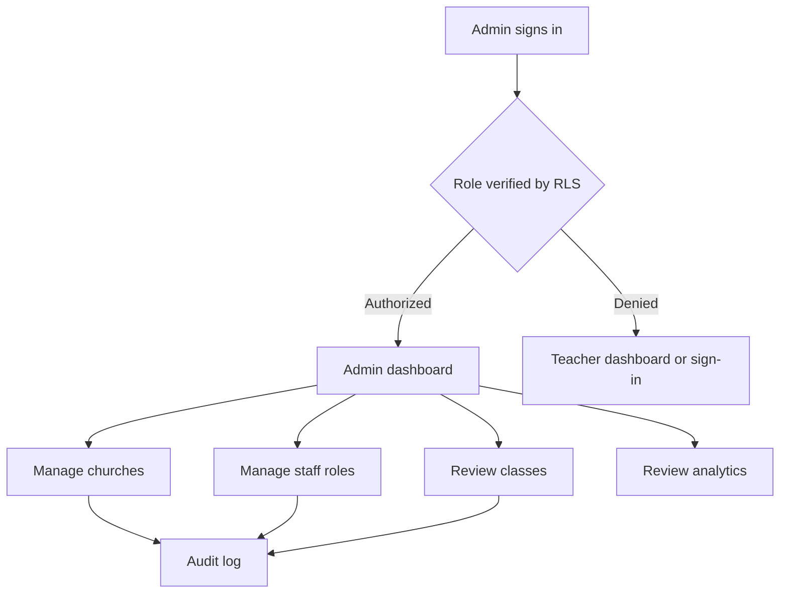

# Administrator Journey

```mermaid
flowchart TD
    A[Admin signs in] --> B{Role verified by RLS}
    B -- Authorized --> C[Admin dashboard]
    B -- Denied --> D[Teacher dashboard or sign-in]
    C --> E[Manage churches]
    C --> F[Manage staff roles]
    C --> G[Review classes]
    C --> H[Review analytics]
    E --> I[Audit log]
    F --> I
    G --> I
```

Privileged changes must be performed through protected database functions and recorded in the audit log.
