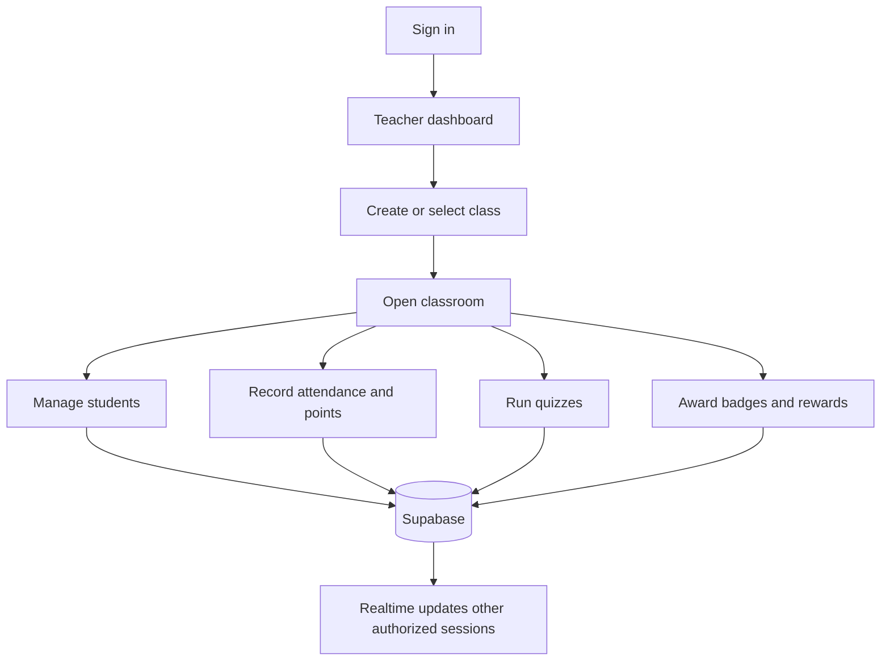

# Teacher Journey

```mermaid
flowchart TD
    A[Sign in] --> B[Teacher dashboard]
    B --> C[Create or select class]
    C --> D[Open classroom]
    D --> E[Manage students]
    D --> F[Record attendance and points]
    D --> G[Run quizzes]
    D --> H[Award badges and rewards]
    E --> I[(Supabase)]
    F --> I
    G --> I
    H --> I
    I --> J[Realtime updates other authorized sessions]
```

## Acceptance outcome

Every successful action persists in Supabase, appears on another authorized device, and remains absent from unauthorized accounts.
