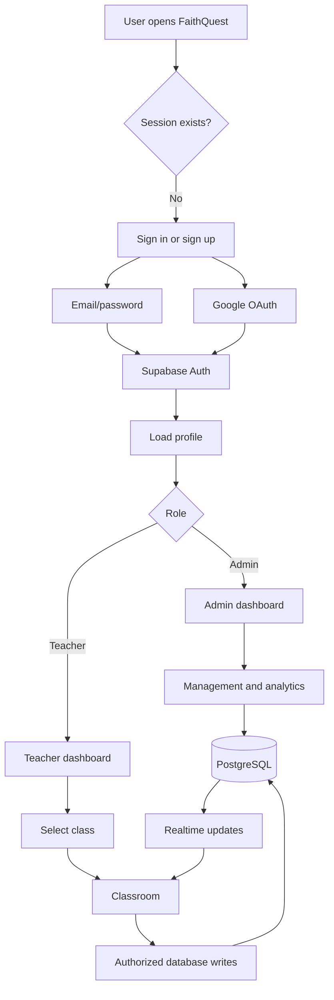

# System Flow

```mermaid
flowchart TD
    U[User opens FaithQuest] --> S{Session exists?}
    S -- No --> L[Sign in or sign up]
    L --> E[Email/password]
    L --> G[Google OAuth]
    E --> A[Supabase Auth]
    G --> A
    A --> P[Load profile]
    P --> R{Role}
    R -- Admin --> AD[Admin dashboard]
    R -- Teacher --> TD[Teacher dashboard]
    TD --> C[Select class]
    C --> CL[Classroom]
    CL --> W[Authorized database writes]
    W --> DB[(PostgreSQL)]
    DB --> RT[Realtime updates]
    RT --> CL
    AD --> M[Management and analytics]
    M --> DB
```

See [[Authentication Flow]] and [[Data Synchronization]].
