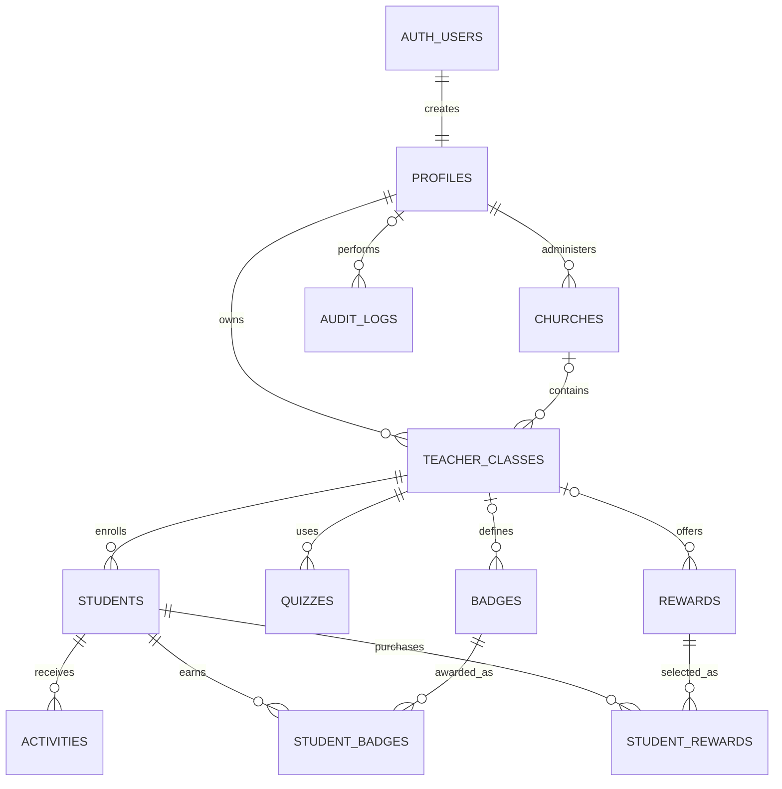

# Entity Relationship Diagram

```mermaid
erDiagram
    AUTH_USERS ||--|| PROFILES : creates
    PROFILES ||--o{ CHURCHES : administers
    PROFILES ||--o{ TEACHER_CLASSES : owns
    CHURCHES o|--o{ TEACHER_CLASSES : contains
    TEACHER_CLASSES ||--o{ STUDENTS : enrolls
    STUDENTS ||--o{ ACTIVITIES : receives
    TEACHER_CLASSES ||--o{ QUIZZES : uses
    TEACHER_CLASSES o|--o{ BADGES : defines
    STUDENTS ||--o{ STUDENT_BADGES : earns
    BADGES ||--o{ STUDENT_BADGES : awarded_as
    TEACHER_CLASSES o|--o{ REWARDS : offers
    STUDENTS ||--o{ STUDENT_REWARDS : purchases
    REWARDS ||--o{ STUDENT_REWARDS : selected_as
    PROFILES o|--o{ AUDIT_LOGS : performs
```

`STUDENT_BADGES` is part of the target design and is not present in the current migration files.
